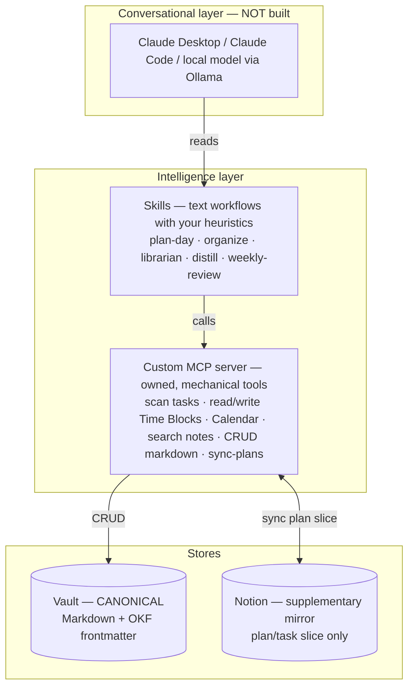

# Second brain — system design

The map of the whole system: its layers, where state lives, and how the pieces
compose. A fresh session (Claude or a local model) reads this to know what
exists. Living doc — `[[?]]`/`(?)` marks an open decision.

## Context and goals

Everything serves a set of long-term goals (reviewed each 12-week cycle):

1. Reach Senior/Staff level — near-term, deliver impact at my company.
2. Become a data science educator (writing, speaking, teaching).
3. Keep building ML projects.
4. Grow finances (≥50% invested, decisions logged).
5. Prioritise family (intentional time with my partner).
6. Fitness (climbing, running).

Goals 1–3 are the professional spine, 4–6 the personal spine. A 12-week cycle
draws 1–3 focus goals across both.

## The three layers



**1. Stores.** The vault is the canonical source of truth for almost
everything. Notion is a *supplementary mirror* of the plan/task slice (details
in [Source of truth](#source-of-truth)).

**2. Intelligence layer — two halves:**

- **A custom MCP server you own** (small Python/TS service). Exposes the vault +
  scheduling as *mechanical* tools: scan the vault for tasks, read/write the
  Time Blocks plugin's `data.json`, query Google Calendar, search notes, CRUD
  Markdown files, and run the plan-sync. Deliberately **no workflow logic** —
  just structured data access. Because MCP is model-agnostic, it works with
  Claude today and a local model (Ollama) tomorrow. This is what makes the
  second brain *programmable*.
- **Skills** — reusable text instructions that encode *how you work* (heuristics
  baked in). They call MCP tools in specific sequences. Just prompts: easy to
  edit, version, and experiment with, no code changes. This is the layer that
  evolves.

**3. Conversational layer — not built.** Claude Desktop / Claude Code / a local
model handles it. The model reads your skills, calls your MCP tools, and reasons
across both. Swap the model, keep everything else identical.

## Source of truth

- **Vault = canonical.** Best medium for agents (Markdown + MCP + git history).
- **Notion = supplementary mirror** of the plan/task slice only. Best medium for
  *human* actions (checkboxes, drag, mobile). It is an editing surface, not a
  second truth.
- **What syncs:** files whose OKF `type` is in the syncable set — **`task` and
  `plan`**. Every other type (`note`, `paper`, `concept`, `index`, `daily`,
  `course-note`) is vault-only and never touches Notion.
- **How much syncs:** the **whole file** — frontmatter → Notion page properties,
  and the **body → Notion page content** (subtask checkboxes, descriptions).
  Bidirectional on the full file.
- **Reconciliation = last-writer-wins by timestamp.** The agent writes a plan →
  vault + mirror to Notion. If the *user* edits it in Notion, Notion's
  `last_edited_time` is newer than the vault's `timestamp` → the change flows
  **back into the vault**. User intent beats the agent's initial plan; the vault
  always ends up holding the truth.
- **Requirements** (all present or cheap): a stable `id` in each task's
  frontmatter linking it to its Notion row; a `last_synced` marker to detect
  direction; the OKF `timestamp` field (added in the migration) as the
  comparison primitive; and the narrow scope above (what keeps two-way sync
  tractable).
- **Caveat:** editing the *same* item in both places between syncs → last-writer
  silently wins. Acceptable for a solo system.
- **Mechanism:** a `sync-plans` MCP tool (or a `/sync` skill run at the
  start/end of a planning session). Not always-on — a reconciliation pass you
  trigger.

## Tasks vs notes

The OKF `type` field is the discriminator, and it lets two representations
coexist meaningfully:

- **Inline checkbox in a `type: note`** (`- [ ] …`) = an *ephemeral, note-local*
  todo. Never syncs — a jot in context.
- **A `type: task` (or `plan`) file** = a *committed* **container** (a
  phase/project). Syncs to Notion, content and all. Its body checkboxes are
  **steps** — the atomic, schedulable, completable units.

**Promoting** a checkbox into a `type: task` container is exactly the "organize"
step of the queue: capture as a jot → commit by making it a task. Location
(`planning/`) organises tasks; `type` is the authority on what syncs.

### Container / step granularity

A container carries the shared classification (cycle, roadmap, category, quarter,
priority) once; each step inherits it. Steps hold only their own inline bits:
`[size:: S|M|L]` (a story-point → block duration), `📅` due, `[↗](url)`. A step
is addressed by `"<path>:<line>"` — the **same id the Time Blocks plugin uses**,
so a scheduled step gets native in-canvas completion + click-to-source. Coarse
planning (cycle/roadmap) operates on containers; daily time-blocking schedules
steps. Because steps are line-addressed, the MCP **only ever edits files in
place** — a reflow would shift line numbers and orphan every step id and block.

## Knowledge side (done)

- Vault is an Obsidian vault of Markdown + OKF frontmatter (`type` required,
  `resource`, `timestamp`, `tags`), topic folders each with `_index.md`.
- Links are **Markdown relative links** (portable, cross-repo capable); genuine
  placeholders stay as `[[wikilinks]]`.
- Intake: `_inbox/` + the `/librarian` skill files notes into topic folders and
  rebuilds indexes (`scripts/rebuild_indexes.py`).

## Directory layout

```text
second-brain/                 umbrella (own git repo); launch point for the planner
├── docs/                      system docs: system-design.md, decisions.md
├── planning/                  planner config (planning-config.md)
├── mcp/                       (?) the custom MCP server (to build)
├── .claude/skills/            planner: plan-cycle, today, weekly (+ plan-day)
└── notes/                     the Obsidian vault (own git repo) = knowledge
    ├── knowledge/             ml/ · cs/ · math/ · finance/ · career/ · courses/ · attachments/ · assets/
    ├── _inbox/                raw captures (→ /librarian files into knowledge/)
    ├── planning/              type: task/plan files live here
    ├── _templates/  _layouts/  scripts/
    └── .claude/skills/        knowledge: capture, distill, librarian, pick
```

Launch Claude at `second-brain/` for the planner agent; at `second-brain/notes/`
for the knowledge agent — two agents, split by launch location.

## Rollout

**First deliverable — the time-blocking planner:** an MCP tool set (read
tasks + calendar state, write Time Blocks `data.json`) + a daily-planning skill
that encodes scheduling heuristics (deep work before noon, admin after, ≥90-min
focus blocks, ≤6h active work/day), wired to Claude Desktop. A working "plan my
day" within a couple of weekends.

Then grow organically, each capability = a skill + maybe a tool or two:

1. Time-blocking planner (MCP tools + `plan-day` skill) — first.
2. Plan/task sync (`sync-plans` tool) — vault ↔ Notion.
3. Research ingestion skill (literature template + link to project notes).
4. Project-context skill (assemble PRD background).
5. Weekly-review skill (audit done vs planned, surface deadlines).
6. **EchoVault — the retention service.** A *separate* service (own FastAPI
   backend, own SM-2 store in `EchoVault/`), incorporated by: (a) repointing its
   backend at `knowledge/`; (b) exposing `reviews_due` / `generate_cards` /
   `grade_review` as MCP tools; (c) **weaving retention into the loop** —
   `plan-day`/`today` surface reviews-due (a day = tasks + reviews) and can
   schedule a review block, `/librarian` auto-generates cards after filing a
   note, and a `/review` skill runs sessions. The vault stays the knowledge
   truth; EchoVault owns only the cards + schedule.

## Open decisions `(?)`

- **Personal spine** — goals 4–6 not yet decomposed into a roadmap.
- **MCP server language** — Python vs TypeScript.
- **Notion mirror shape** — reuse the existing sandbox DBs as the mirror target,
  or a fresh mirror DB.
- **EchoVault path** — its backend still points at the pre-move vault location;
  needs reconfig.
- **grill-me ↔ EchoVault** — independent, or does grill-me pull due cards?
